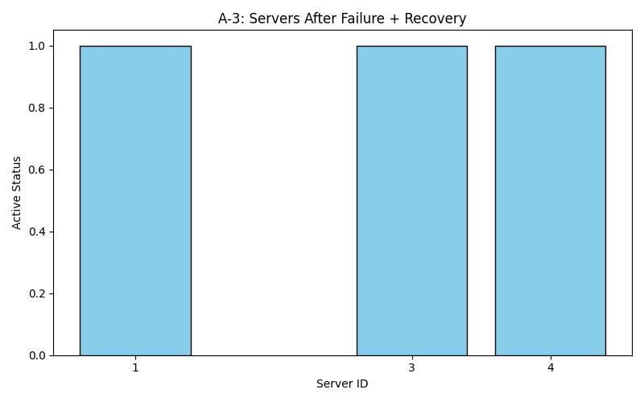

# 🚦 Customized Load Balancer

A Dockerized load balancer built with Flask that distributes asynchronous client requests evenly across multiple server replicas using **consistent hashing**. Designed for fault-tolerant, scalable request routing in distributed systems.

---git 

## 🧱 Project Structure

* **Task 1 – Web Server**: Lightweight Flask server with health check endpoints.
* **Task 2 – Consistent Hashing**: Custom hashing logic for even distribution using a circular hash ring.
* **Task 3 – Load Balancer** *(WIP/Implemented)*: Container that routes requests, manages replica states, and handles failures dynamically.
* **Task 4 – Analysis**: Performance testing and system behavior evaluation under load and failure.

---

## 🖥️ Task 1: Web Server

Each server runs a Flask app and exposes two endpoints:

| Method | Endpoint     | Description                        |
| ------ | ------------ | ---------------------------------- |
| GET    | `/home`      | Returns a greeting with server ID  |
| GET    | `/heartbeat` | Returns `200 OK` for health checks |

### 🔁 Example Response

```json
{
  "message": "Hello from Server: 1",
  "status": "successful"
}
```

> Server ID is set via environment variable at container runtime.

---

## 🧠 Task 2: Consistent Hashing

Implements a hash ring with 512 slots to route requests based on consistent hashing. Ensures minimal re-mapping during scale-up/down and fault recovery.

### 🔍 Details

* **Hash Ring Size**: 512 slots
* **Virtual Nodes per Server**: 9 (K = log₂512)
* **Hash Functions**:

  * Requests: `H(i) = i + 2i² + 17`
  * Virtual Servers: `Φ(i,j) = i + j + 2j² + 25`
* **Collision Resolution**: Linear probing

### 📦 Supported Functions

```python
add_server(server_id)      # Adds server with virtual replicas
remove_server(server_id)   # Removes server and its replicas
get_server_for_key(key)    # Gets server for a given request ID
```

---

## 🔄 Sample Usage

```python
from consistent_hash import ConsistentHash

ch = ConsistentHash()
ch.add_server(1)
ch.add_server(2)
ch.add_server(3)

for i in range(10):
    server = ch.get_server_for_key(i)
    print(f"Request {i} routed to Server {server}")
```

---

## 📡 Task 3: Load Balancer (Planned or Included)

The load balancer should:

* Route requests using consistent hashing
* Manage and expose replicas via these endpoints:

  * `GET /rep` — List active server containers
  * `POST /add` — Add server instances
  * `DELETE /rm` — Remove server instances
  * `GET /<path>` — Route to underlying servers (e.g. `/home`)
* Monitor heartbeats and auto-restart failed servers (via Docker API)
* Be containerized and connect all replicas in a shared Docker network

---

---

## 📊 Task 4: Performance Analysis

This task simulates and evaluates how the consistent hashing implementation distributes client requests, handles server failures, and behaves under modified hash functions.

---

### 🧪 A-1: Request Distribution on 3 Servers

- **Simulation**: 10,000 requests sent to 3 servers.
- **Configuration**: 2048 slots, 100 virtual replicas per server.
- **Hash Function**: `md5(key)` → uniform distribution
- **Goal**: Measure how evenly requests are distributed.

**Sample Output:**

```text
A-1 Results: {1: 3342, 2: 3320, 3: 3338}
```

**Visualization:**


---

### 📈 A-2: Scalability Across 2 to 6 Servers

- **Simulation**: Run 10,000 requests each while increasing server count from 2 to 6.
- **Goal**: Track average load per server.

**Sample Output:**

```text
A-2 Results: [5000.0, 3333.3, 2500.0, 2000.0, 1666.6]
```

**Visualization:**


---

### 🧯 A-3: Failure and Recovery

- **Scenario**:
  1. Start with servers 1, 2, 3.
  2. Simulate failure by removing server 2.
  3. Simulate recovery by adding server 4.
- **Goal**: Verify correct removal and integration of replicas.

**Sample Output:**

```text
A-3 Results: [1, 3, 4]
```

**Visualization:**



---

### 🔁 A-4: Modified Hash Functions

- **Hash Functions Used**:
  - `H(i) = sha256(i)`
  - `Φ(i,j) = sha256(f"{i}-{j}")`
- **Goal**: Evaluate the impact of different hash functions on distribution.

**Sample Output:**

```text
A-4 Modified Results: {1: 3311, 2: 3365, 3: 3324}
```

**Visualization:**


---

### ✅ Status

- [x] Balanced load distribution with cryptographic hashes
- [x] Smooth scalability across multiple server counts
- [x] Successful simulation of failure and recovery
- [x] Consistent distribution with alternate hash functions

The analysis validates that the consistent hashing system is **scalable**, **fault-tolerant**, and **load-balanced**.

---

## 🐳 Deployment

### Requirements

* Docker ≥ 20.10.23
* Docker Compose
* Python 3.8+

### Run with Docker Compose

```bash
make build     # Build all images
make up        # Launch servers and load balancer
make down      # Tear down all containers
```

Or manually:

```bash
docker-compose up --build
```

---

## 📁 Repo Contents

| File/Dir             | Description                             |
| -------------------- | --------------------------------------- |
| `server/`            | Flask web server code                   |
| `load_balancer/`     | Load balancer routing logic             |
| `consistent_hash.py` | Consistent hashing module               |
| `Dockerfile`         | Builds server or balancer container     |
| `docker-compose.yml` | Multi-container setup and networking    |
| `Makefile`           | Simplified commands for build/run/clean |
| `README.md`          | Project overview and setup              |

---

## 📚 References

* [Docker Docs](https://docs.docker.com/get-started/)
* [CS168 – Stanford: Consistent Hashing](https://web.stanford.edu/class/cs168/l/l1.pdf)
* [Makefile Tutorial](https://makefiletutorial.com/)
* [shardQ Sample Project](https://github.com/prasenjit52282/shardQ)

